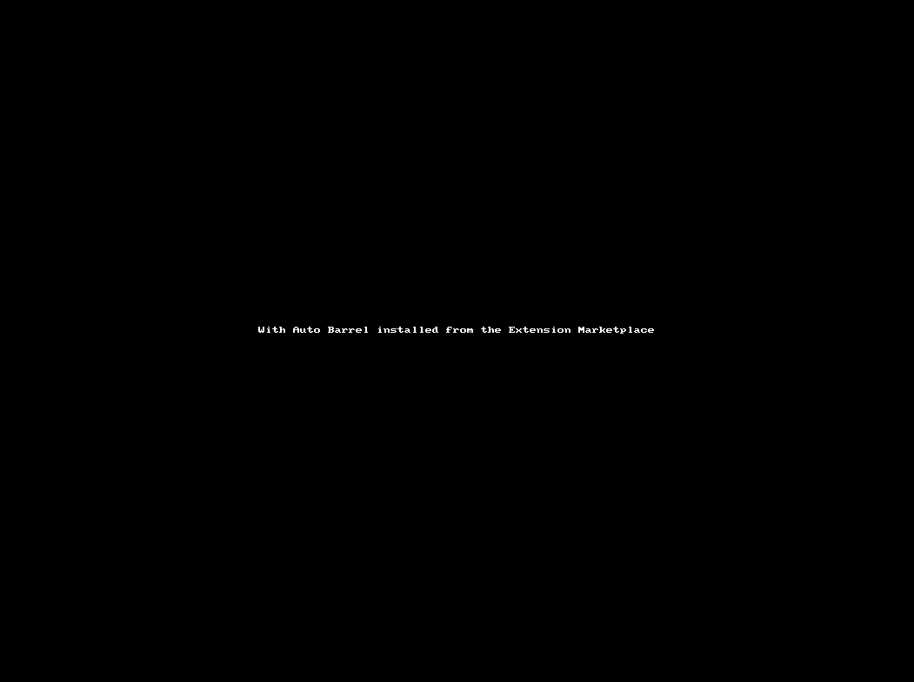

# Auto Barrel

Auto Barrel adds support for creating a barrel (index.[tj]s) in a folder and optionally keeping it up to date automatically.



## Features

Create Barrel - Right click on any folder in Explorer viewlet and this command allows you to create a new barrel with export statements for all other files of the same language.

Auto Barrel - Start - From the command pallete execute this command to have Auto Barrel automatically add and delete export statements as files are added or deleted from the folder.

Auto Barrel - Stop - From the command pallete execute this command to stop automatic management of barrel files.

You can also prevent Auto Barrel from treating existing index.[tj]s files as barrels by adding a comment to the file

## Extension Settings

The following settings can be configured to control the behaviour of Auto Barrel.

```javascript
'autoBarrel.defaultLanguageExtension';
```

This defaults to TypeScript (ts). Supported values are ts or js. When Create Barrel is executed Auto Barrel attempts to determine the language extension from the contents of the folder. If all of the files in the folder have the same extension it will create a barrel file with that extension. If the file contains both .ts and .js files Create Barrel will use this setting.

```javascript
'autoBarrel.alwaysUseDefaultLanguageExtension';
```

This defaults to false. If this is set to true then the Create Barrel command will not attempt to determine the language extension it will create a barrel file with the extension set in autoBarrel.defaultLanguageExtension.

```javascript
'autoBarrel.watchGlob';
```

This defaults to _\*\*\/src\/\*\*\/\*.[tj]s_. When the Auto Barrel - Start command is executed from the Command Pallette this setting is used to configure a File System Watcher to monitor file creation and deletion using this setting. Since the most common convention is to put source files in a src folder below a workspace root Auto Barrel uses a default that will watch for creation or deletion of .ts and .js files in any folder below any src folder. If you use a different convention or want to limit to either .ts or .js files you can change the glob.

For example to ignore .js files change it to _\*\*\/src\/\*\*\/_.ts* or to ignore .ts files change it to *\*\*\/src\/\*\*\/_.ts_

```javascript
'autoBarrel.ignoreFilePathContainingAnyOf';
```

A comma separated list of path fragments that should be ignored. This defaults to _.spec,.test_ so that test files located next to the source file are not included in barrels as is the default when using tools such as angular-cli to generate components.

The setting is used to prevent files where the full path contains any of the fragments from being added to new or existing barrel files.

```javascript
'autoBarrel.useImportAliasExportPattern';
```

This defaults to false.  If this is set to true then instead of simply exporting files included in the barral like this
```javascript
export * from './auth.actions';
```
We import the file with an alias derived from the name and export the alias something like this
```javascript
import * as AuthActions from './auth.actions';

export { AuthActions };
```
The alias uses both dots and hyphens as word separators to build the alias.  A file name like **login-page.actions** will result in an alias of **LoginPageActions**

## Ignoring Potential Barrel Files

If your workspace/s contain existing index.ts or index.js files that are matched by the autoBarrel.watchGlob pattern, but they are not barrel files you can tell Auto Barrel to ignore them during automatic monitoring by adding the following comment as the first line of the file.

```javascript
// auto-barrel-ignore
```

If Auto Barrel detects a file creation in a folder containing a potential barrel file and the barrel file contains this comment as the first line it will abort processing and make no further attempt to add an export for the new file. This can also be achieved using the _ignoreFilePathContainingAnyOf_ setting introduced in v1.0.3 but this method is still valid.

## Automating Start

If you would like to have Auto Barrel start monitoring for changes when you open a workspace we recommend the excellent [Auto Run Command](https://marketplace.visualstudio.com/items?itemName=gabrielgrinberg.auto-run-command#overview) extension. With the extension installed simply add a rule something like this to User Settings

```javascript
"auto-run-command.rules": [
    ...
     {
         "condition": [
             "always"
         ]
         "command": "autoBarrel.start",
         "message": "Starting Auto Barrel..."
     }
 ]
```

**Enjoy!**
